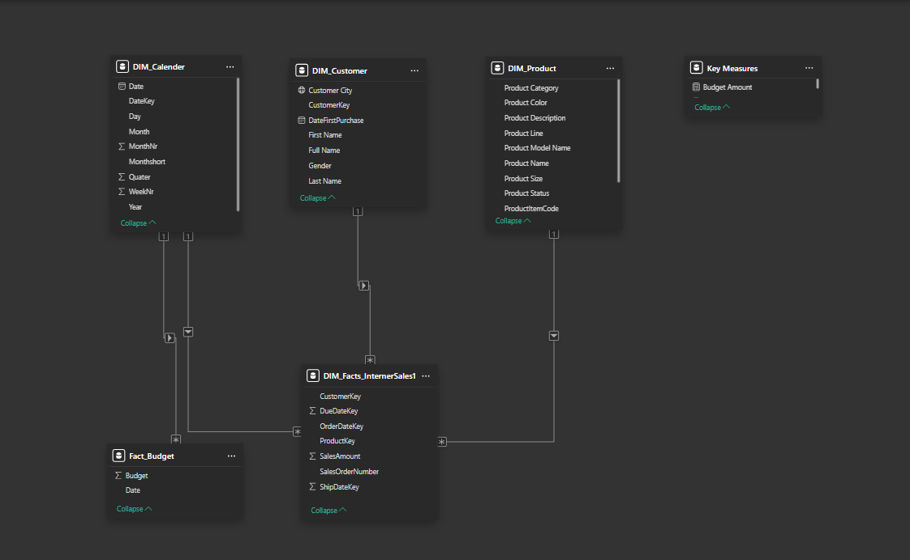
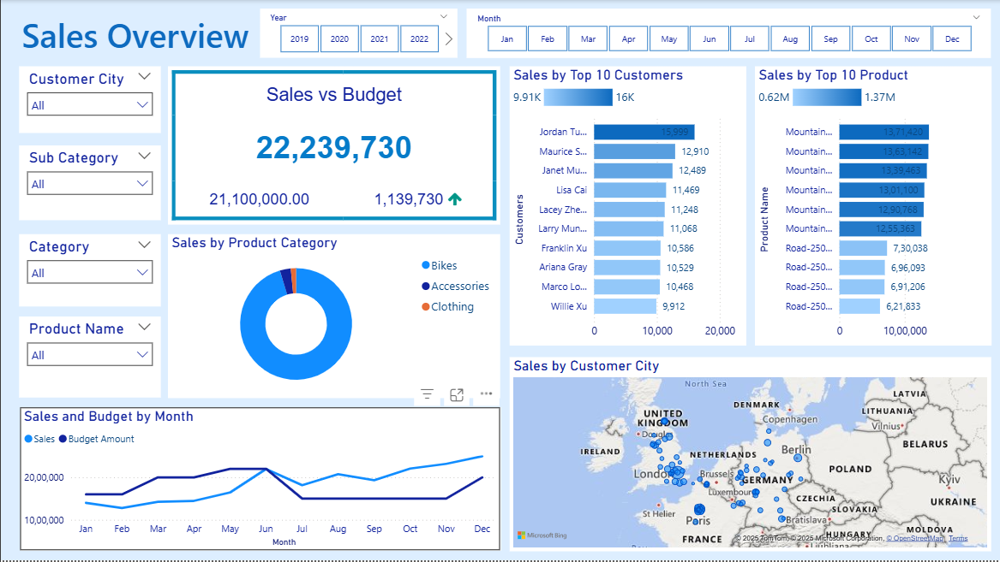

# Sales Analysis Dashboard 
This project presents an interactive Sales Dashboard to analyze online sales performance, compare Actual vs Budget, and gain insights into product and customer trends.

> Objective:
   - Track Total Sales performance over time
   - Monitor Actual vs Budget and variance
   - Identify Top Products driving revenue
   - Understand Customer Purchase Behavior
   - Make better data-driven decisions

> Dataset Details (Cleaned & Updated):
- Structured using a Star Schema:

  Dataset                   	Type	               Purpose
- FACT_InternetSales	        Fact	       Sales transaction data
- FACT_Budget	                Fact	       Target values for comparison
- DIM_Product	              Dimension	     Product attributes
- DIM_Customer	            Dimension	     Customer info for segmentation
- DIM_Date	                Dimension 	   Enables time-based insights
 
> Data Source:
 AdventureWorksDW — Microsoft SQL Server Sample Data Warehouse

- Data Preparation:
   - SQL (SSMS): Used for Scripting and Updated date fields to current years for realistic and relevant reporting
   - Power Query: Cleaned and transformed data (types, formatting, filtering)
 
> Data Model:
 

> Dashboard Insights:
 
 
 

> KPIs displayed:
  - Total Sales Amount
  - Budget vs Actual Variance
  - Top 10 Revenue-Generating Products
  - Customer Purchase Insights

> Tools & Technologies Used:
  - Power BI Desktop ->Dashboard & DAX measures
  - SQL Server Management Studio (SSMS) ->	Data cleaning,tranformation and updation scripting 
 

