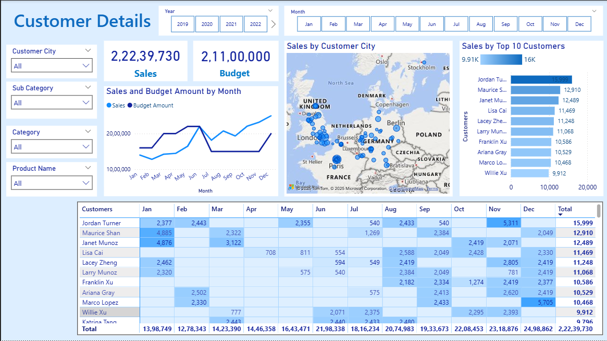
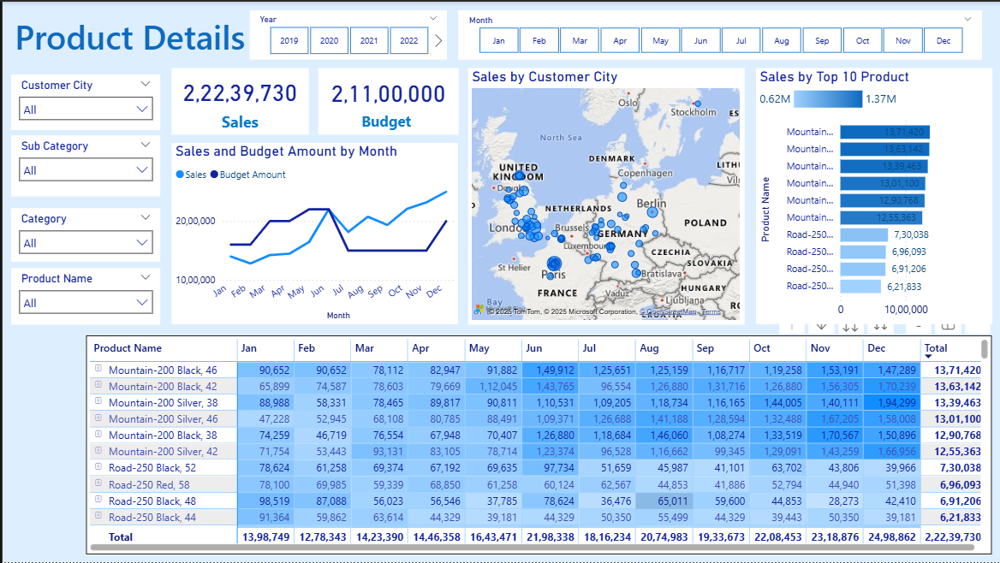

# Sales Analysis Dashboard 
This project presents an interactive Sales Performance Dashboard to analyze online sales from AdventureWorksDW. The dashboard provides insights into Actual vs Budget, product performance, and customer trends to support better decision-making.

> Objective:
   - Track Total Sales performance over time
   - Monitor Actual vs Budget and variance
   - Identify Top revenue driving products
   - Understand Customer Purchasing Behavior
   - Make better data-driven decisions

> Dataset Details (Cleaned & Updated):                	
- FACT_InternetSales -> Fact -> Sales transaction data
- FACT_Budget -> Fact -> Target values for comparison
- DIM_Product -> Dimension -> Product attributes
- DIM_Customer	-> Dimension -> Customer info for segmentation
- DIM_Date -> Dimension -> Enables time-based insights
 
> Data Source:
 AdventureWorksDW — Microsoft SQL Server Sample Data Warehouse
 (Used full data model but filtered to relevant tables)

> Data Preparation:
   - SQL (SSMS): Used for Scripting and Updated date fields to current years for realistic and        relevant reporting
   - Power Query: Data type correction, formatting and filtering
 
> Data Model:
 

> Dashboard Insights:
 
 
 

> Tools & Technologies Used:
  - Power BI Desktop ->Dashboard & DAX measures
  - SQL Server Management Studio (SSMS) ->	Data cleaning,tranformation and updation scripting 
 
> Business Documentation
- Business Demand Overview & User Stories – located in the `Documents` folder

